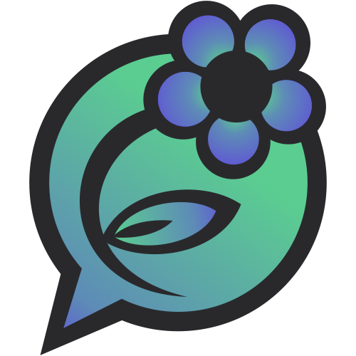

<h1 align="center">Uchat | Green ✿ Chat</h1>

<div align="center"></div>

<h2 align="center">📬 Overview</h2>

**Uchat** was the last big product challenge of Track C, the second stage of the [**Innovation Campus**](https://campus.kpi.kharkov.ua/en/) educational program. Our team, [**Emerald Devs**](#team), was invited to accept the battle and **create our own messaging app** that solves a real-world problem with limited resources **using only C** programming language. We had 7 weeks (21.10.24-11.12.24) to design and implement the solution.

Our **Green Chat** is a feature-rich, reliable and user-friendly desktop instant messaging application primarily developed to serve the needs of students of Innovation Campus and its employees. The application provides its users with a single space where students can easily communicate with peers and mentors, reducing the need to juggle multiple communication tools, and fostering a greater sense of belonging within the program.

> Design of **Green Chat** was inspired by [**ALFA Green LMS**](https://show.green-lms.app/).

<h2 align="center" id="features">🌟 Features</h2>

<details>
<summary><b>🗝️ Friendly Sign Up/In</b>: quickly access the chat.</summary>
Register or log in to your account with a unique username and secure password. Toggle password visibility and receive feedback messages to guide you through the process.
<div align="center"></div>
</details>

<details>
<summary><b>👥 Private Chats and Groups</b>: communicate with different people for different purposes.</summary>
Create one-on-one chats and view profile information of the person you are chatting with. Create group conversations and view the group members.
<div align="center"></div>
<div align="center"></div>
</details>

<details>
<summary><b>😃 Rich Messaging</b>: send not only instant texts, but also files, images, emojis and voice.</summary>
Enhance your communication with voice messages, images and files. Bring joy to your conversations with a variety of emojis.
<div align="center"></div>
</details>

<details>
<summary><b>🎙️Voice Calling</b>: stay connected anytime.</summary>
Have quick brainstorms and convenient collaborations on pair assignments with voice calls in private chats.
<div align="center"></div>
<div align="center"></div>
</details>

<details>
<summary><b>✍️ Message Management</b>: edit or delete messages effortlessly.</summary>
Have more control over your communication with the ability to edit and delete your messages after sending. Save received files to your computer.
<div align="center"></div>
</details>

<details>
<summary><b>🧑 User Management</b>: change your profile description or password.</summary>
View and manage your personal profile with options to update your full name, group, and status. Change your password for better security.
<div align="center"></div>
<div align="center"></div>
</details>

<details>
<summary><b>🫂 Built-In Support</b>: report bugs and suggest improvements.</summary>
Tell us your problems and provide feedback directly within the application.
<div align="center"></div>
</details>

<h2 align="center">💻 Technology Stack</h2>

- **Programming Language**: C  
- **Backend**: OpenSSL, SQLite3
- **Frontend**: GTK3, CSS, GStreamer
- **Data Format**: cJSON  

<h2 align="center">🚀 How to Use</h2>

_Step 1: Clone the Repository_

Clone the repository to your local machine and navigate to the project directory.

```bash
git clone https://github.com/VeronikaSukhonos/uchat.git
cd uchat
```
---
_Step 2: Build the Project_

Make sure that you have GTK3, GStreamer, OpenSSL, and SQLite3 preinstalled on your machine, and compile the application using the `make` command.

```bash
make
```

- This will create two programs in the project directory: `uchat` and `uchat_server`.

---
_Step 3: Run the Server_

Open a terminal in the project directory and start the server.

```bash
./uchat_server <port>
```

- Replace `<port>` with the desired port number the server should listen on (e.g., 8080).
- The server will start as the daemon, display its process id and wait for client connections.
 
---
_Step 4: Run the Client_

Open another terminal in the project directory and start the client.

```bash
./uchat <server_ip> <port>
```

- Replace `<server_ip>` with the IP address of the machine running the server (use 127.0.0.1 for local testing).
- Replace `<port>` with the same port number used to start the server.
- The client will connect to the server and allow interaction.

---
_Step 5. Start Chatting_
 
Use the client to log in or register, and have a seamless [**experience**](#features) with the **Green Chat**!

---
_Step 6. Stop the Server_

When you are done, stop the server by terminating the process using the `kill` command.

```bash
kill <server_process_id>
```

- Replace `<server_process_id>` with the process id that was displayed earlier.

<h2 align="center">🌱 Reflection</h2>

Developing this project provided us with invaluable hands-on experience, including:
- designing and implementing a client-server architecture for real-time communication.
- managing a database to store and retrieve user and message data.
- creating a responsive and intuitive GUI using GTK3.
- integrating multimedia features like file sharing and voice calling.
- addressing challenges in real-time message synchronization, error handling, and security.

This was fun, exciting and greatly enhanced our understanding of robust software development practices and teamwork!

<h2 align="center" id="team">🙌 Our Team</h2>

- [**Mykyta Cherevan**](https://github.com/Nikcher256)  <br />
- [**Veronika Sukhonos**](https://github.com/VeronikaSukhonos)  <br />
- [**Yevheniia Rezchyk**](https://github.com/EvgeniaRezchik)  <br />
- [**Polina Rezchyk**](https://github.com/BekkaMushko) <br />
- [**Olesia Malanchuk**](https://github.com/nishiinoya) <br />
- [**Yehor Dmytryk**](https://github.com/EgorDmitruk) <br />

Check out our [**presentation**](https://docs.google.com/presentation/d/1GL6oyKt0esMKFtQdNDHDuPoXPnWy5SBbzkq2d5a2ZxA/) for more information!

<h2 align="center">📜 License</h2>

This project is licensed under the **MIT License**. See the [**LICENSE**](./LICENSE.txt) file for more details.  
